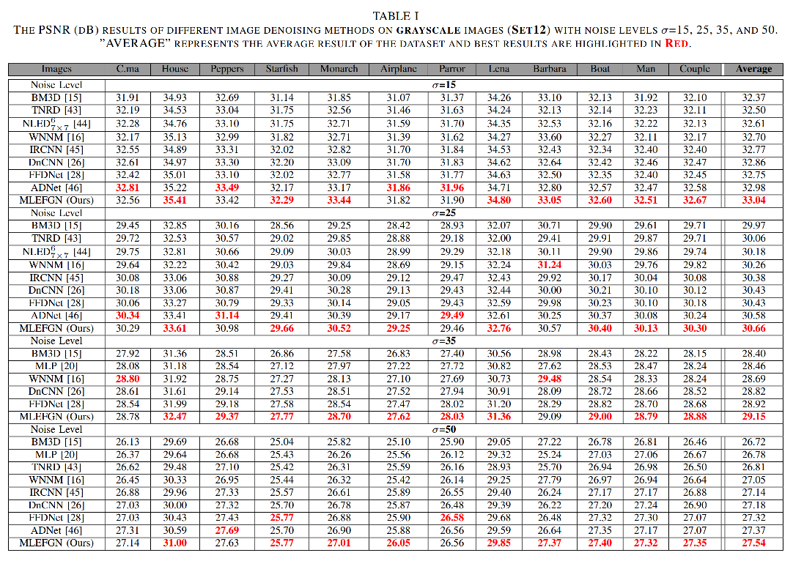
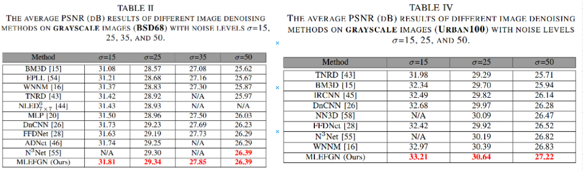
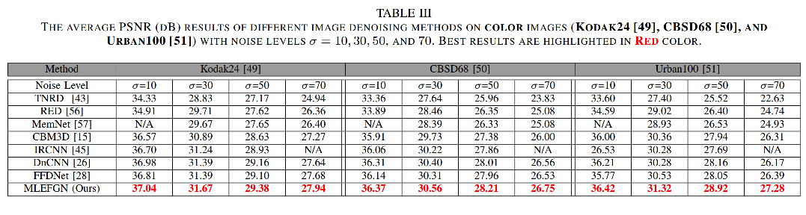
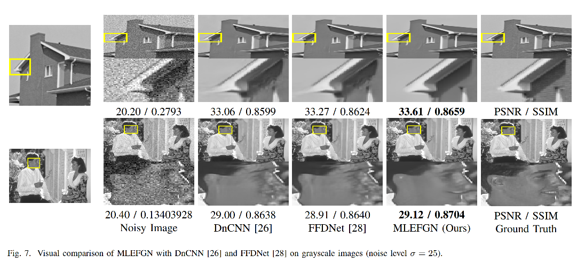
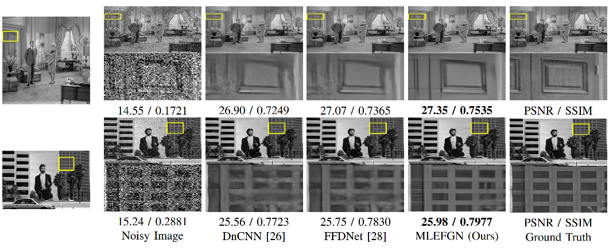
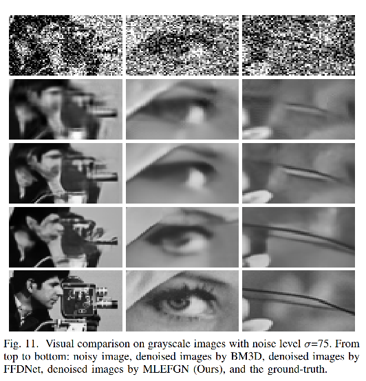

# MLEFGN-PyTorch
### This repository is an official PyTorch implementation of 'MLEFGN'.

This paper has been submitted to TNNLS.

Paper and Code will be released soon.

## Performance

###  PSNR Results on Grayscale Images

###  PSNR Results on Color Images

### Visual Comparison

### All reconstructed images will be provided soon.

