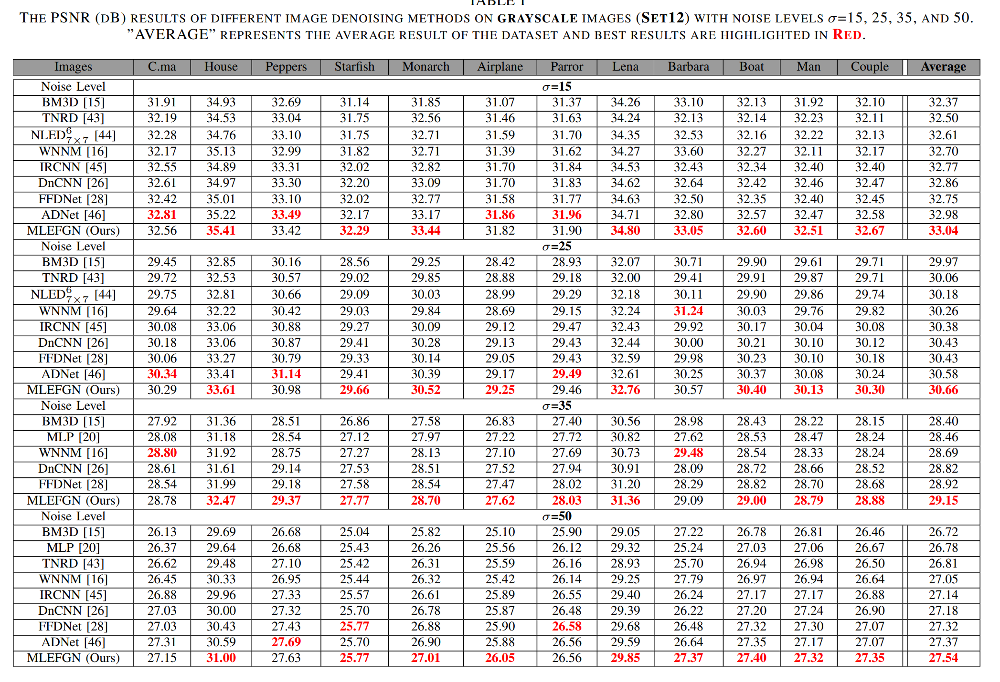
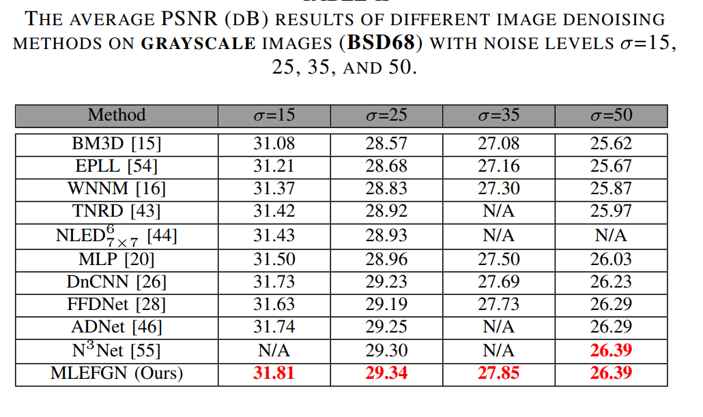
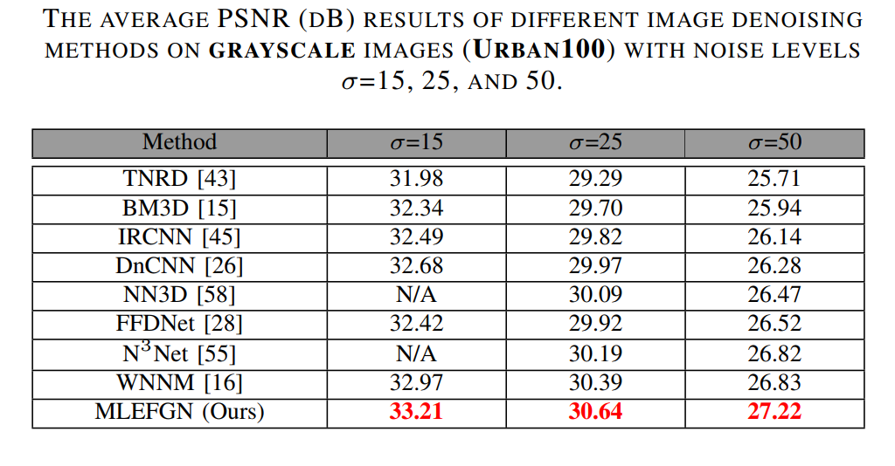
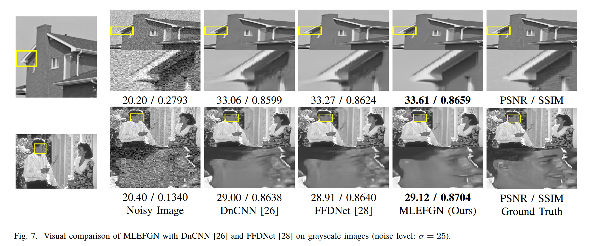
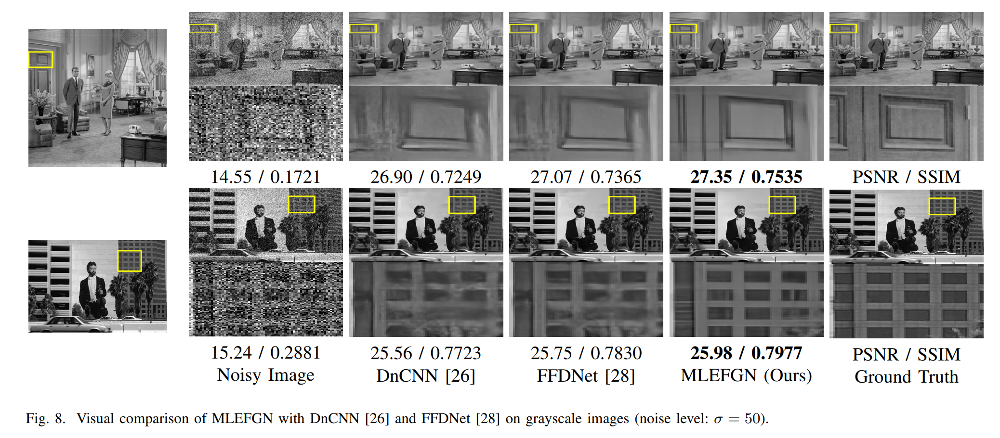
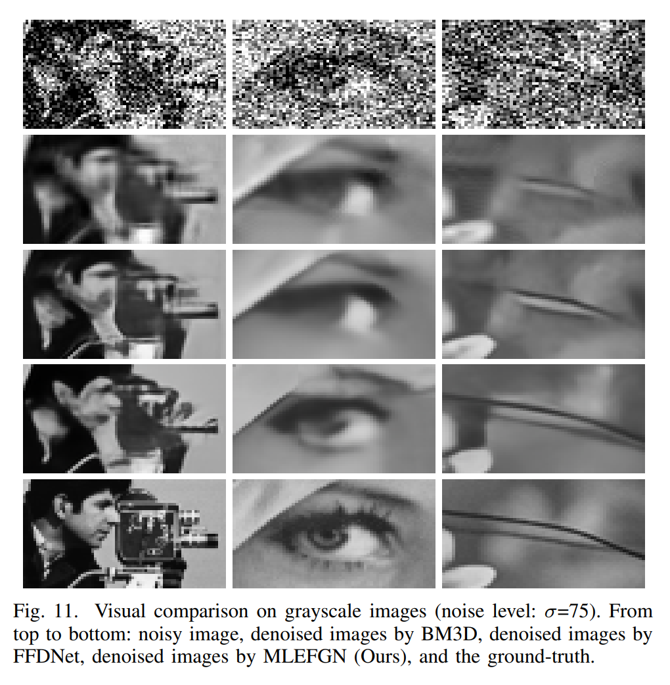
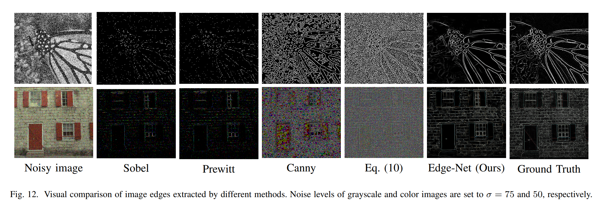

# MLEFGN-PyTorch
### This repository is an official PyTorch implementation of the paper ''Multi-level Edge Features Guided Network for Image Denoising''.  (TNNLS 2020)

This paper has been accepted by IEEE TNNLS. The release version is coming soon.

The early version can be downloaded from <a href="https://junchenglee.com/projects/TNNLS2020_MLEFGN">MLEFGN</a> 

Homepage: <a href="https://junchenglee.com/projects/TIP2020_SEANET/">MLEFGN</a> 

Image denoising is a challenging inverse problem due to the complex scenes and information loss. Recently, various methods have been considered to solve this problem by building a well-designed convolutional neural network (CNN) or introducing some hand-designed image priors. Different from previous works, we investigate a new framework for image denoising, which integrates edge detection, edge guidance, and image denoising into an end-to-end CNN model. To achieve this goal, we propose a Multi-level Edge Features Guided Network (MLEFGN). Firstly, we build an edge reconstruction network (Edge-Net) to directly predict clear edges from the noisy image. Then, the Edge-Net is embedded as part of the model to provide edge priors and a dual-path network is applied to extract image and edge features, respectively. Finally, we introduce a multilevel edge features guidance mechanism for image denoising. To the best of our knowledge, the Edge-Net is the first CNN model specially designed to reconstruct image edges from the noisy image, which shows good accuracy and robustness on natural images. Extensive experiments clearly illustrate that our MLEFGN achieves favorable performance against other methods and plenty of ablation studies demonstrate the effectiveness of our proposed Edge-Net and MLEFGN.

 

</p>

##Prerequisites

1. Python 3.6

2. PyTorch >= 0.4.0

3. numpy

4. skimage

5. imageio

6. matplotlib

7. tqdm

For more informaiton, please refer to <a href="https://github.com/thstkdgus35/EDSR-PyTorch">EDSR</a> and <a href="https://github.com/yulunzhang/RCAN">RCAN</a>.

In order to quickly verify the idea, we directly use the EDSR code, which is originally a code for image super-resolution.

We regard the image denoising task as a super-resolution task with an upsampling factor of x1. Therefore, when using this code, we set the scale = 1.

## Document

Train/         : all train files are stored here

Test/          : all test files are stored here

Matlab/        : all data processing and PSNR measurement files

README.md      : read me first

demo.sh        : all running instructions

## Dataset

We use DIV2K dataset as clear images to train our model. Please download it from <a href="https://data.vision.ee.ethz.ch/cvl/DIV2K/">here</a>  or  <a href="https://cv.snu.ac.kr/research/EDSR/DIV2K.tar">SNU_CVLab</a>. Put all clear images into the Train/dataset/DIV2K/DIV2K_train_HR

As for clear edges, we apply Matlab/generate_edge_gray.m or generate_edge_color.m on DIV2K to generate clear images edges, which are served as the label of Edge-Net. Meanwhile, put them into the Train/dataset/DIV2K/DIV2K_train_EDGE

As for noisy images, we use Matlab/generate_noise.m to generate noisy images and put them into the Train/dataset/DIV2K/DIV2K_train_LR_bicubic/x1

##Training

Using --ext sep_reset argument on your first running. 

You can skip the decoding part and use saved binaries with --ext sep argument in second time.

```python
## train
python main.py --template MLEFGN --save MLEFGN_Gray_15 --scale 1 --reset --save_results --patch_size 64 --ext sep_reset
```

##Testing

Using pre-trained model for training, all test datasets must be pretreatment by  Prepare_TestData_HR_LR.m and all pre-trained model should be put into Test/model/ first. Meanwhile, all test image must be put into dataset_name/x1,  like Set12/x1.

```python
## test MLEFGN
python main.py --data_test MyImage --scale 1 --model MLEFGN --pre_train ../model/gray_15.pt --test_only --save_results --chop --save "MLEFGN_Gray_15" --testpath ../LR/LRBI --testset Set12
```

You also can use self-ensemble strategy to improve our MLEFGN and denote the self-ensembled version as MLEFGN+.

```python
## test MLEFGN+
python main.py --data_test MyImage --scale 1 --model MLEFGN --pre_train ../model/gray_15.pt --test_only --save_results --chop --self_ensemble --save "MLEFGN_Gray_15_plus" --testpath ../LR/LRBI --testset Set12
```


## Performance

PSNR  code can be found in the Matlab/PSNR folder.

###  PSNR Results on Grayscale Images

<p align="center">

</p>

<p align="center">
 
</p>

<p align="center">
 
</p>

###  PSNR Results on Color Images


### Visual Comparison

<p align="center">
 
</p>
 
</p>
 
</p>
 
</p>


### All reconstructed images will be provided soon.
### All pre-trained model will be provided soon.

This work was completed in 2018, a long time ago, so there may be omissions in the code finishing process. If you have any questions, please contact me!


```
@InProceedings{fang2020soft,
    title = {Multi-level Edge Features Guided Network for Image Denoising},
    author = {Fang, Faming and Li, Juncheng, Yuan Yiting, Zeng, Tieyong, and Zhang Guxiu},
    booktitle = {IEEE Transactions on Neural Networks and Learning Systems},
    publisher = {IEEE}
}
```